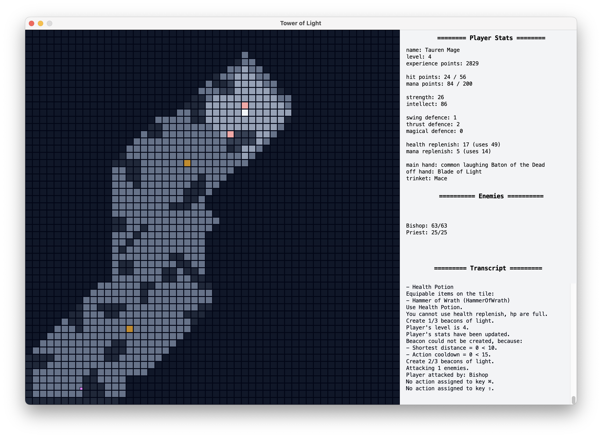

# Tower of Light

## Gameplay

| From Chaos                      | To Light                        |
|---------------------------------|---------------------------------|
|  |  |

## Narrative of the Game

The incentive of the game is to convert all castle levels from chaos to light.
This is accomplished a level at a time. To convert a level from chaos to light
the player needs to create three beacons of light. Then, a portal on the north-east
of the map opens that teleports the player to the next level.

However, the battle to the top castle level is not that smooth. The player needs to
encounter and defeat enemies that spawn at different map positions, outside of player's
view. The player might be able to get away, but not for long. All the enemies follow closely
the player till the find him and kill him. In addition, they get stronger and more ferocious
with a beacon creation. On the other hand, if the player kills the enemies they drop their
weapon and other usable items (health and mana potions).

It is of benefit to the player to kill enemies and equip their weapon in his main- and off-
hand, or even his trinket. Simultaneously, gathering potions on his inventory assists in
difficult times; when hit and mana points run low. Of course, if there are no potions on the
inventory, the player can rest to regain his missing stats. But the rate of recovering is slow...
Enemies might find him easier this way.

## How to Control the Player

### Move

- <kbd>W</kbd> : move up.
- <kbd>S</kbd> : move down.
- <kbd>A</kbd> : move left.
- <kbd>D</kbd> : move right.

### Resting

- <kbd>R</kbd> : rest.

### Creation

- <kbd>L</kbd> : create beacon of light.

### Attack

- <kbd>space</kbd> : attack with weapon.
- <kbd>X</kbd> : attack with spell.

### Usable Items

- <kbd>H</kbd> : replenish health.
- <kbd>M</kbd> : replenish mana.

### Equipable Items

- <kbd>T</kbd> : change main hand.
- <kbd>Y</kbd> : change off hand.
- <kbd>U</kbd> : change trinket.

## Technicalities for the Nit Pickers

Some details that were not mentioned on the previous paragraph are listed on the following
Subsections.

### Levels

The player gains levels based on his experience points. The experience points can be gained
by creating beacons of light and killing enemies.

The rule that dictates the advancement of the player's levels is the following:

| Level | Experience Points |
|-------|-------------------|
| 1     | 0 - 299           |
| 2     | 300 - 899         |
| 3     | 900 - 2699        |
| 4     | 2700 - 6499       |
| 5     | 6500 - 13999      |
| 6     | 14000+            |

### Race

The player's race is responsible for the initialization of player's statistics, and it is the first argument
to launch the program. The race statistics are given in the following arrays.

#### ORC

| Strength | Intellect | Swing Defense | Thrust Defense | Magic Defense | Hit Points | Mana Points |
|----------|-----------|---------------|----------------|---------------|------------|-------------|
| 10       | 8         | 1             | 1              | 0             | 0          | 0           |

#### Tauren

| Strength | Intellect | Swing Defense | Thrust Defense | Magic Defense | Hit Points | Mana Points |
|----------|-----------|---------------|----------------|---------------|------------|-------------|
| 12       | 6         | 1             | 2              | 0             | 0          | 0           |

#### Human

| Strength | Intellect | Swing Defense | Thrust Defense | Magic Defense | Hit Points | Mana Points |
|----------|-----------|---------------|----------------|---------------|------------|-------------|
| 9        | 9         | 1             | 1              | 1             | 0          | 0           |

#### Elf

| Strength | Intellect | Swing Defense | Thrust Defense | Magic Defense | Hit Points | Mana Points |
|----------|-----------|---------------|----------------|---------------|------------|-------------|
| 6        | 12        | 0             | 1              | 2             | 0          | 0           |

### Warrior Class

The player's warrior class is responsible for the updating of player's statistics, and it is the second argument
to launch the program. The warrior class updating schemes are given in the following arrays.

#### Knight

| Level | Bonus Hit Points | Bonus Mana Points | Bonus Strength | Bonus Intellect |
|-------|------------------|-------------------|----------------|-----------------|
| 1     | 10               | 0                 | 2              | 0               |
| 2     | 15               | 0                 | 4              | 0               |
| 3     | 20               | 0                 | 6              | 0               |
| 4     | 25               | 0                 | 8              | 0               |
| 5     | 30               | 0                 | 10             | 0               |
| 6     | 40               | 0                 | 12             | 0               |

#### Mage

| Level | Bonus Hit Points | Bonus Mana Points | Bonus Strength | Bonus Intellect |
|-------|------------------|-------------------|----------------|-----------------|
| 1     | 8                | 20                | 2              | 8               |
| 2     | 12               | 40                | 3              | 16              |
| 3     | 16               | 60                | 4              | 24              |
| 4     | 20               | 80                | 5              | 32              |
| 5     | 24               | 100               | 6              | 40              |
| 6     | 30               | 120               | 7              | 48              |

#### Paladin

| Level | Bonus Hit Points | Bonus Mana Points | Bonus Strength | Bonus Intellect |
|-------|------------------|-------------------|----------------|-----------------|
| 1     | 10               | 10                | 5              | 5               |
| 2     | 13               | 20                | 7              | 9               |
| 3     | 16               | 30                | 9              | 13              |
| 4     | 20               | 40                | 11             | 17              |
| 5     | 28               | 50                | 13             | 21              |
| 6     | 40               | 700               | 15             | 25              |

### Enemies

There are plenty of enemies that appear on different levels. As the castle levels grow, the abilities of the enemies
become more enhanced. The following array aggregates their stats to be prepared of what you will cope with.

| Name            | Hit Points | Weapon          | Swing Defense  | Thrust Defense | Magic Defense  | Experience Points | Level |
|-----------------|------------|-----------------|----------------|----------------|----------------|-------------------|-------|
| Priest          | 20         | Mace            | 0              | 0              | Infinity       | 30                | 1,2   |
| Vampire         | 20         | Dagger          | 0              | 0              | Infinity       | 30                | 1,2   |
| Knight          | 30         | Blade of Light  | 3              | 3              | 1              | 50                | 2,3,4 |
| Chaos Knight    | 30         | Sword of Chaos  | 3              | 3              | 1              | 50                | 2,3,4 |
| Bishop          | 40         | Staff           | 0              | 0              | 5              | 60                | 2,3,4 |
| Summoner        | 40         | Summoning Staff | 0              | 0              | 5              | 60                | 2,3,4 |
| Paladin         | 100        | Hammer of Wrath | 5              | 3              | 2              | 80                | 3,4,5 |
| Fallen Hero     | 100        | Ebon Blade      | 5              | 3              | 2              | 80                | 3,4,5 |
| Archangel       | 130        | Divine Hammer   | 6              | 6              | 2              | 120               | 4,5,6 |
| Friend          | 130        | Demon Claws     | 6              | 6              | 2              | 200               | 5,6   |
| Herald of Light | 160        | Lightbringer    | Reduce to half | Reduce to half | Reduce to half | 400               | 6     | 
| Herald of Chaos | 160        | Edge of Chaos   | Reduce to half | Reduce to half | Reduce to half | 400               | 6     |

The weapons of the enemies have the following stats. They are not boosted by any of the stats, they just use them to
attack the player.

| Name            | Swing Damage | Thrust Damage | Magical Damage | Hit Points Bonus | Mana Points Bonus | Strength Bonus | Intellect Bonus |
|-----------------|--------------|---------------|----------------|------------------|-------------------|----------------|-----------------|
| Mace            | 1d6 + 1      | 0             | 0              | 0                | 0                 | 0              | 0               |               
| Dagger          | 0            | 1d6 + 1       | 0              | 0                | 0                 | 0              | 0               |               
| Blade of Light  | 0            | 2d6 + 1       | 1d3 + 1        | 0                | 0                 | 0              | 0               |               
| Sword of Chaos  | 0            | 2d6 + 1       | 1d3 + 1        | 0                | 0                 | 0              | 0               |               
| Staff           | 2d6 + 2      | 0             | 1d6 + 1        | 0                | 0                 | 0              | 0               |               
| Summoning Staff | 2d6 + 2      | 0             | 1d6 + 1        | 0                | 0                 | 0              | 0               |               
| Hammer of Wrath | 2d6 + 1      | 0             | 2d6 + 1        | 0                | 0                 | 0              | 0               |               
| Ebon Blade      | 2d6 + 2      | 0             | 2d6 + 2        | 0                | 0                 | 0              | 0               |               
| Devinne Hammer  | 0            | 2d6 + 4       | 2d6 + 2        | 0                | 0                 | 0              | 0               |               
| Demon Claws     | 2d6 + 4      | 0             | 2d6 + 2        | 0                | 0                 | 0              | 0               |               
| Lightbringer    | 1d6 + 2      | 3d6 + 2       | 0              | 0                | 10                | 10             | 10              |               
| Edge of Chaos   | 1d6 + 2      | 3d6 + 2       | 0              | 0                | 10                | 10             | 10              |               

The meaning of `<num1>d<num2> + <num3>` is literally the results of a rolling dice. The `<num1>` specifies the number of
dices, the `<num2>` the sides of each dice and the `<num3>` the constant quantity that will be added to the final
result. This is the way that critical hits are modeled in the game.

### Miscellaneous

- The player starts with a random weapon that does not belong to enemies weapons.
- The time in the game is discrete and depends on the player's actions. First the player executes its logic and then the
  game continues.
- Weapons change in a circular manner; meaning that if three weapons are on the same tile the player can change between
  them by just pressing the changing button multiple times. This is based on "conservation of items principal".
- At each beacon creation enemies are incremented by 2 and are becoming stronger and healthier.
